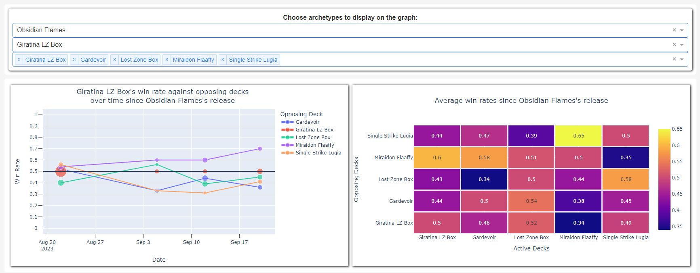
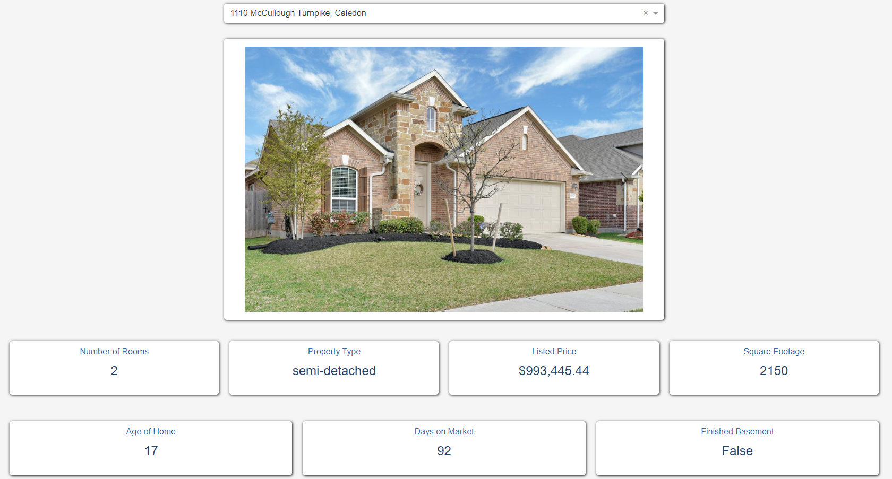

*Last updated: September 27, 2023*

## Data Visualization Projects

### [Pokemon Trading Card Game Dashboard](../blog/pkmn-tcg-dash/)
  

A dashboard that tracks match-up data in the Pokemon Trading Card Game over time. 

### [Peel Region Real Estate Comparison Dashboard](../blog/real-estate-dash)
 

A dashboard that displays listing information and determine if a listing is fairly priced based on comparable homes on the market. 